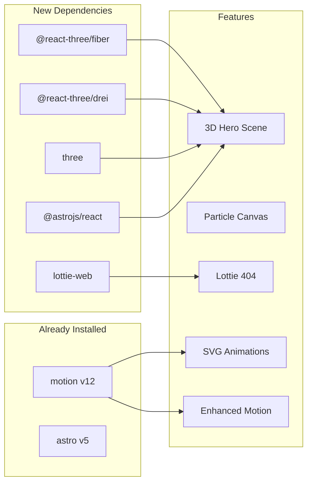

# Add Graphic Content to Portfolio

## Architecture Overview

## Feature 1: 3D Interactive Hero Scene

**New deps:** `@astrojs/react`, `react`, `react-dom`, `three`, `@react-three/fiber`, `@react-three/drei`

- Create `src/components/HeroScene.tsx` — React component with:
  - A floating wireframe **icosahedron** (or torus knot) slowly rotating
  - Subtle mouse-follow effect (mesh tilts toward cursor)
  - Faint glow/bloom using drei's `MeshDistortMaterial` or `MeshWobbleMaterial`
  - Transparent background so it overlays behind hero text
  - Color matches accent theme (cyan/blue tones)
- Update [astro.config.mjs](src/../astro.config.mjs) to add React integration
- Place in hero section of [index.astro](src/pages/index.astro) using `client:visible` (lazy hydration — zero JS until in viewport)
- Positioned absolutely behind hero text with `pointer-events-none` so it doesn't block CTA buttons
- **Bundle impact:** ~150KB gzipped, but deferred via island architecture — does not block initial paint

## Feature 2: Animated Particle Canvas Background

**New deps:** None (vanilla canvas)

- Create `src/components/ParticleBackground.astro` — lightweight `<canvas>` with:
  - ~60 floating semi-transparent dots drifting slowly
  - Connecting lines drawn between nearby dots (network/constellation effect)
  - Subtle mouse repulsion (particles drift away from cursor)
  - Uses `requestAnimationFrame` with visibility check (pauses when off-screen)
  - Respects `prefers-reduced-motion`
- Place behind the **About section** in [index.astro](src/pages/index.astro) as an absolute-positioned canvas
- **Bundle impact:** ~2KB — pure vanilla JS, no library

## Feature 3: Animated SVGs with Motion Library

**New deps:** None (uses existing `motion` v12)

- **Skill badge glow/draw-in:** Add subtle animated borders to skill pills in the About section — a gradient border that "draws in" on scroll using `motion`'s `animate` + `inView`
- **Animated section dividers:** Replace plain `border-t` between sections with subtle animated wave SVG paths that draw on scroll
- **Icon pulse:** Add a subtle scale pulse to the GitHub stat card icons when they come into view
- Files modified: [Layout.astro](src/layouts/Layout.astro) (extend motion script), [index.astro](src/pages/index.astro) (add SVG dividers + classes), [global.css](src/styles/global.css) (keyframes)

## Feature 4: Enhanced Motion Effects

**New deps:** None (uses existing `motion` v12)

- **Number counter animation:** Stats cards (GitHub repos/followers/following/gists and the fun stats strip) count up from 0 when scrolled into view using `motion`'s `animate` with a spring/tween
- **Parallax depth on hero:** The background image shifts slightly on scroll (CSS `transform: translateY`) driven by a scroll listener, giving depth
- **Magnetic hover on CTA buttons:** "More About Me" and "Download Resume" buttons subtly pull toward cursor on hover using mouse position tracking
- **Card tilt on hover:** Certification, open source, and project cards get a subtle 3D tilt effect (`perspective` + `rotateX/Y`) following cursor position within the card
- Files modified: [Layout.astro](src/layouts/Layout.astro) (motion script extensions), [index.astro](src/pages/index.astro) (add data attributes/classes for targeting), possibly [ProjectCard.astro](src/components/ProjectCard.astro)

## Feature 5: Lottie Animation on 404 Page

**New deps:** `lottie-web` (~30KB gzipped)

- Create `src/components/LottieAnimation.astro` — generic wrapper that loads a Lottie JSON and plays it
- Download a free 404/astronaut/lost-in-space Lottie JSON from LottieFiles into `public/animations/404.json`
- Replace the static "404" text in [404.astro](src/pages/404.astro) with the animated Lottie + keep the text as a fallback
- Autoplay, loop, respects `prefers-reduced-motion`
- **Bundle impact:** ~30KB for player + ~20-50KB for the animation JSON

## Performance Summary

| Feature         | Extra JS (gzipped) | Loading Strategy          |
| --------------- | ------------------ | ------------------------- |
| 3D Hero         | ~150KB             | `client:visible` (lazy)   |
| Particle Canvas | ~2KB               | Inline, pauses off-screen |
| SVG Animations  | 0 (existing)       | In-view triggered         |
| Enhanced Motion | 0 (existing)       | In-view triggered         |
| Lottie 404      | ~50KB              | Only on 404 page          |

Total impact on home page initial load: **minimal** — the 3D scene is the heaviest piece but is deferred until the hero is visible, and particles are tiny vanilla JS. The other pages remain unchanged.